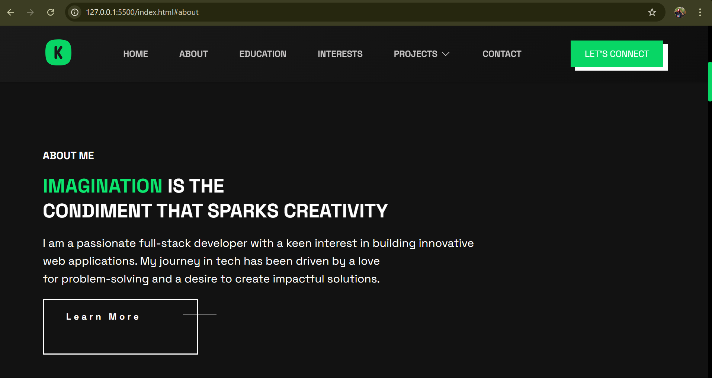
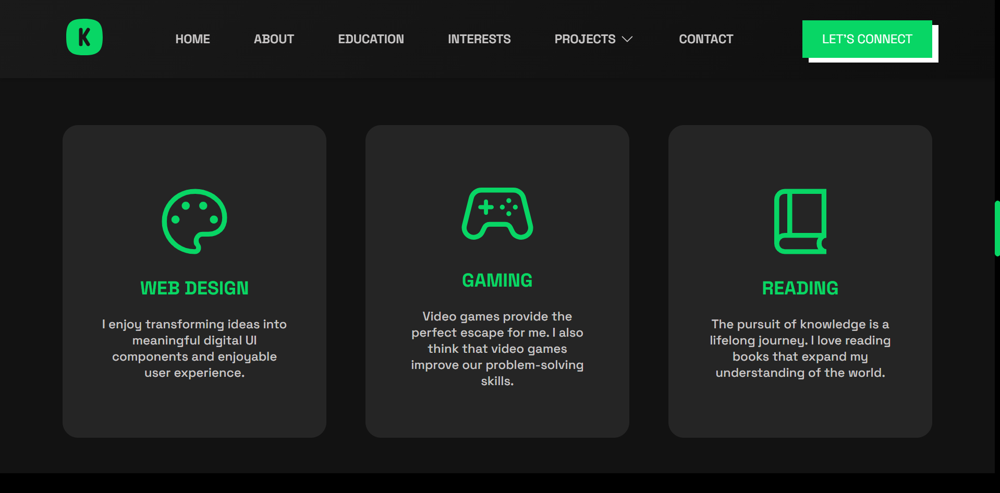
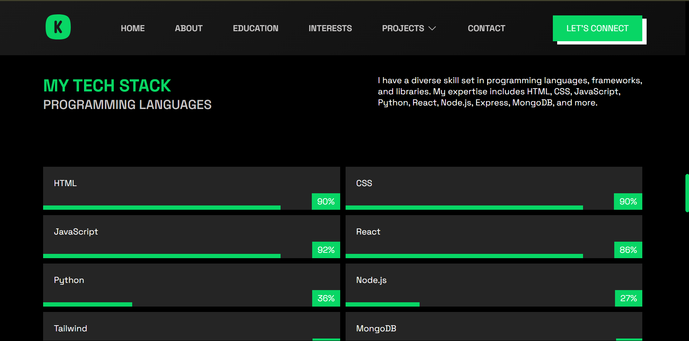
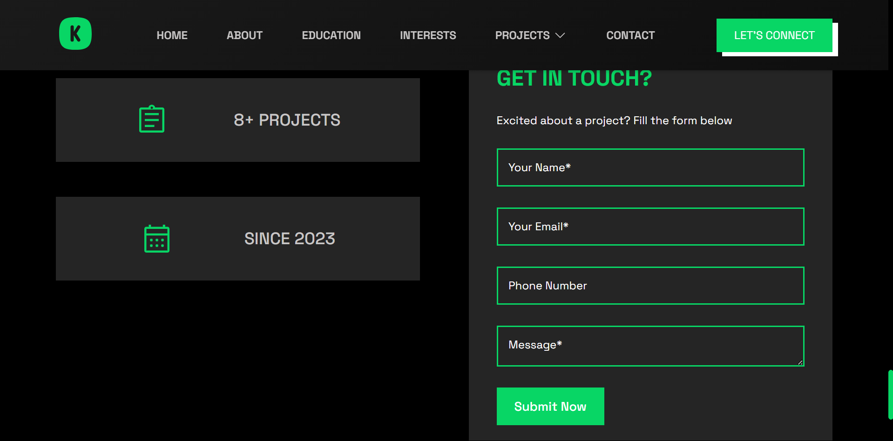
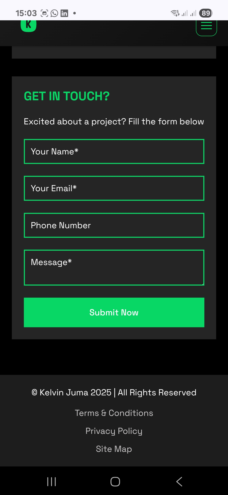
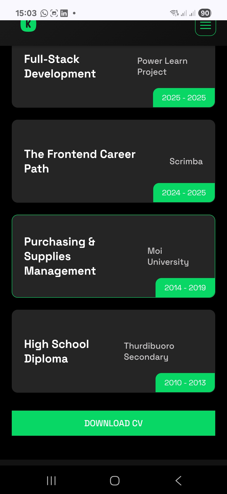
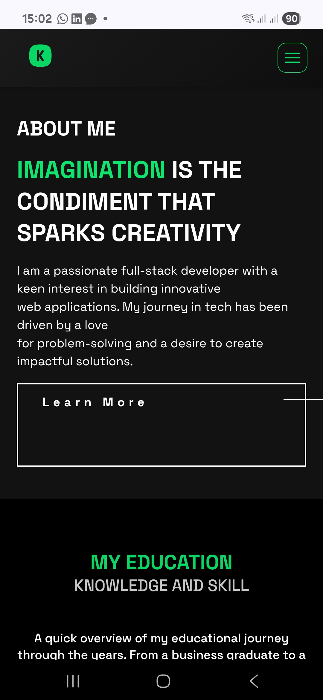
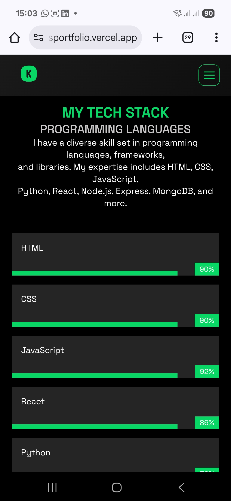

# 🌐 Kelvin Juma | Developer Portfolio

Welcome to my personal portfolio website. 

## 🔗 Live Demo

[Visit the Website](https://kelvinsportfolio.vercel.app)  

---

## 📌 Description

This portfolio is designed to give visitors an overview of who I am, what I do, and what I’ve worked on. It highlights my technical skills, education, interests, and language proficiencies while also providing an easy way to contact me.

---

## 🛠️ Tech Stack

- **HTML5**
- **CSS3**

---

## 📁 Website Sections

The site includes the following major sections:

1. **About Me** – A short bio and introduction
2. **Projects** – A showcase of selected projects with links and descriptions
3. **Education** – Academic background and achievements
4. **Interests** – Personal interests and hobbies
5. **Languages** – Tech Stack - Programming Languages, frameworks, and databases
6. **Contact** – A simple form or links for getting in touch

---

## 📷 Screenshots

### 📌 Desktop or Laptop
<div align="center">
  <table>
    <tr>
      <td></td>
      <td></td>
    </tr>
    <tr>
      <td align="center"><strong>About Section</strong></td>
      <td align="center"><strong>Interests Section</strong></td>
    </tr>
    <tr>
      <td></td>
      <td></td>
    </tr>
    <tr>
      <td align="center"><strong>Languages Section</strong></td>
      <td align="center"><strong>Contact Section</strong></td>
    </tr>
  </table>
</div>

### 📌 Mobile Devices
<div align="center">
  <table>
    <tr>
      <td></td>
      <td></td>
      <td></td>
      <td></td>
    </tr>
    <tr>
      <td align="center"><strong>Screenshot 1</strong></td>
      <td align="center"><strong>Screenshot 2</strong></td>
      <td align="center"><strong>Screenshot 3</strong></td>
      <td align="center"><strong>Screenshot 4</strong></td>
    </tr>
  </table>
</div>

---

## 🧪 How to Run Locally

1. Clone the repository:
   ```bash
   git clone https://github.com/talesofcarter/portfolio-building-hackathon-plp
