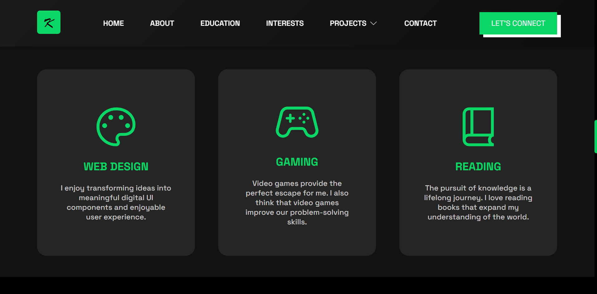
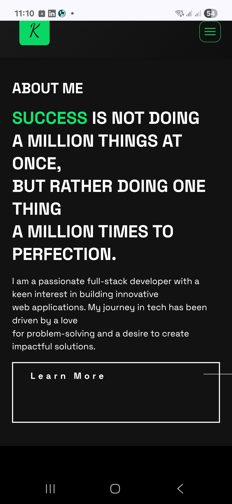
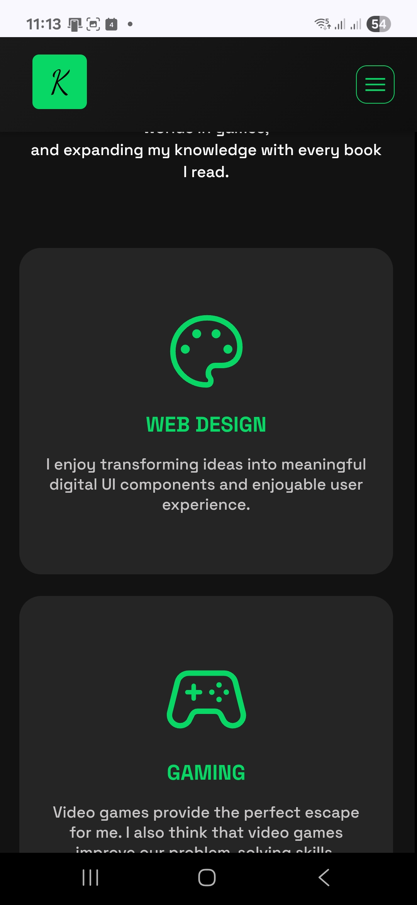
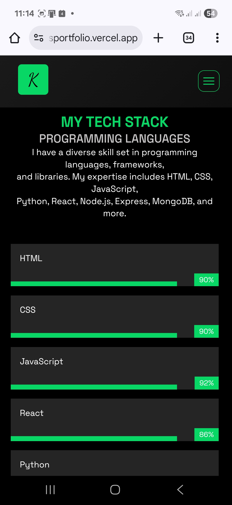
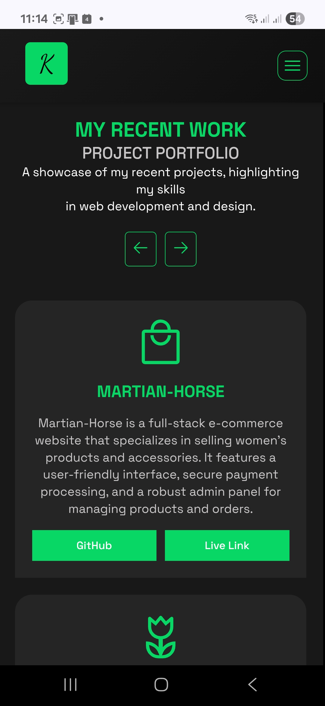

# July 2025 Cohort Hackathon 1: Portfolio Challenge 🚀 - Power Learn Project

My Approach to Power Learn Project Hackathon 1: Building a Professional Portfolio Website Using Industry Best Practices.

## 🌐 Kelvin Juma | Developer Portfolio

Welcome to my personal portfolio website.

## 🔗 Live Demo

[Visit the Website](https://kelvinsportfolio.vercel.app)

---

## 📌 Description

This portfolio offers a clear snapshot of who I am, what I do, and the projects I've worked on. It showcases my technical skills, education, interests, and language proficiencies—all while making it easy for visitors to get in touch with me.

---

## 🛠️ Tech Stack

- **HTML5**
- **CSS3**

---

## 📦 Dependencies

- **Google Fonts**

  - Space Grotesk

- **Google Icons**
  - 🍔 Hamburger Menu
  - ⬆️ Arrows
  - 🎨 Palette
  - 🎮 Controller
  - 📚 Book
  - 🛍️ Shopping bag
  - 🌷 Flower
  - 📜 Crossword
  - 📝 Notepad
  - 📅 Calendar

---

## 📁 Website Sections

The site includes the following major sections:

1. **About Me** – A short bio and introduction
2. **Projects** – A showcase of selected projects with links and descriptions
3. **Education** – Academic background and achievements
4. **Interests** – Personal interests and hobbies
5. **Languages** – Tech Stack - Programming Languages, frameworks, and databases
6. **Contact** – A simple form or links for getting in touch

---

## 📷 Screenshots

### 💻 Desktop or Laptop

<div align="center">
  <table>
    <tr>
      <td></td>
      <td></td>
    </tr>
    <tr>
      <td align="center"><strong>About Section</strong></td>
      <td align="center"><strong>Interests Section</strong></td>
    </tr>
    <tr>
      <td></td>
      <td></td>
    </tr>
    <tr>
      <td align="center"><strong>Languages Section</strong></td>
      <td align="center"><strong>Contact Section</strong></td>
    </tr>
  </table>
</div>

### 📱 Mobile Devices

<div align="center">
  <table>
    <tr>
      <td></td>
      <td></td>
      <td></td>
      <td></td>
    </tr>
    <tr>
      <td align="center"><strong>Screenshot 1</strong></td>
      <td align="center"><strong>Screenshot 2</strong></td>
      <td align="center"><strong>Screenshot 3</strong></td>
      <td align="center"><strong>Screenshot 4</strong></td>
    </tr>
  </table>
</div>

---

## 🧪 How to Run Locally

1. Clone the repository:

   ```bash
   git clone https://github.com/talesofcarter/portfolio-building-hackathon-plp

   ```

2. Run the project:
   ```bash
   In your computer, open the index.html file with live server

   ```
